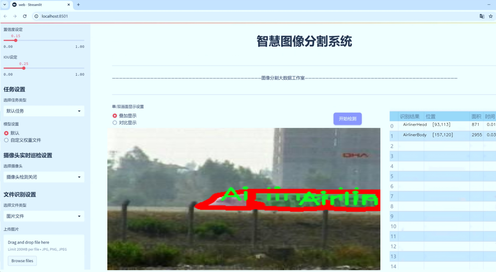
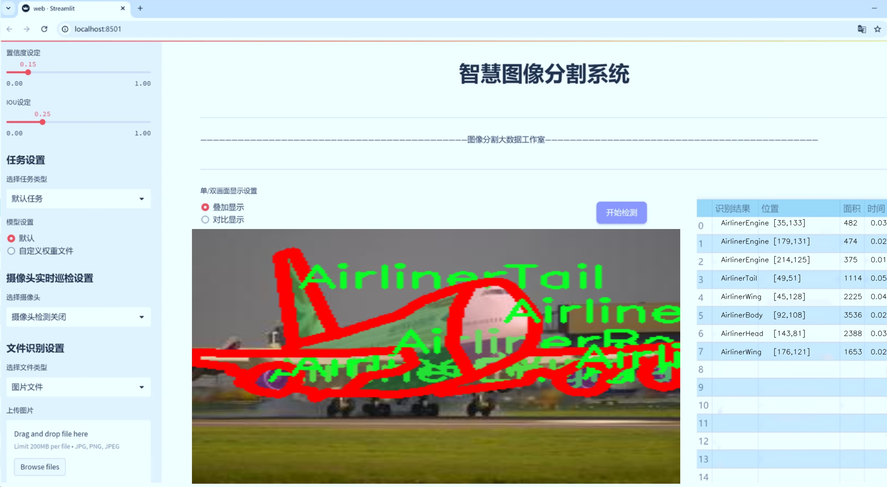
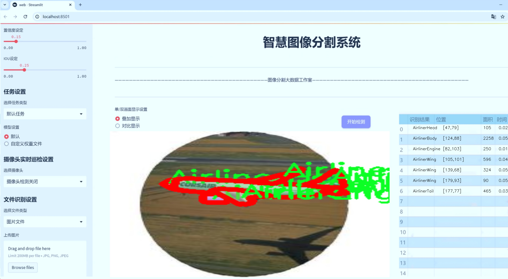
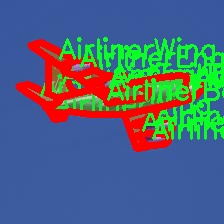
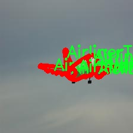
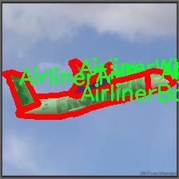
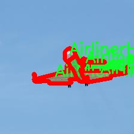

# 飞机构件识别图像分割系统： yolov8-seg-p2

### 1.研究背景与意义

[参考博客](https://gitee.com/YOLOv8_YOLOv11_Segmentation_Studio/projects)

[博客来源](https://kdocs.cn/l/cszuIiCKVNis)

研究背景与意义

随着无人机技术的迅猛发展，飞行器的应用范围不断扩大，涵盖了从军事侦察到民用物流等多个领域。在这一背景下，飞机构件的高效识别与分割成为了提升无人机智能化水平的关键技术之一。传统的图像处理方法在处理复杂背景和多样化目标时，往往面临着识别精度低、处理速度慢等问题。因此，基于深度学习的图像分割技术逐渐成为研究的热点，尤其是基于YOLO（You Only Look Once）系列模型的改进，因其在实时性和准确性上的优越表现，受到了广泛关注。

本研究旨在基于改进的YOLOv8模型，构建一个高效的飞机构件识别图像分割系统。YOLOv8作为YOLO系列的最新版本，结合了多种先进的深度学习技术，能够在保持高识别精度的同时，实现实时处理。这一特性使得YOLOv8非常适合于飞机构件的识别与分割任务，尤其是在复杂环境下的应用。通过对YOLOv8的改进，我们希望进一步提升其在飞机构件识别中的表现，特别是在处理不同种类飞机构件时的准确性和鲁棒性。

在数据集方面，本研究使用了PartImageNet数据集，该数据集包含1800张图像，涵盖31个类别的飞机构件和生物体部件，包括飞机的机身、引擎、机头、机尾、机翼等。这些类别的多样性为模型的训练提供了丰富的样本，能够有效提升模型的泛化能力。此外，数据集中还包含多种背景，如绿色背景、冰雪背景等，这为模型在不同环境下的应用提供了良好的基础。通过对这些图像的实例分割，模型能够学习到不同部件的特征，从而实现更为精准的识别和分割。

本研究的意义不仅在于技术上的创新，更在于其在实际应用中的广泛前景。随着无人机技术的不断进步，飞机构件的自动识别与分割将极大地提升无人机的自主飞行能力和智能决策水平。这对于提高飞行器的安全性、降低操作成本、提升工作效率等方面具有重要的现实意义。此外，基于YOLOv8的图像分割系统还可以推广至其他领域，如智能监控、自动驾驶等，为相关行业的发展提供技术支持。

综上所述，基于改进YOLOv8的飞机构件识别图像分割系统的研究，不仅具有重要的学术价值，也为无人机技术的应用提供了新的思路和方法。通过对飞机构件的精准识别与分割，我们期待能够推动无人机智能化的进程，为未来的航空科技发展贡献力量。

### 2.图片演示







注意：本项目提供完整的训练源码数据集和训练教程,由于此博客编辑较早,暂不提供权重文件（best.pt）,需要按照6.训练教程进行训练后实现上图效果。

### 3.视频演示

[3.1 视频演示](https://www.bilibili.com/video/BV18PUNYxEAn/)

### 4.数据集信息

##### 4.1 数据集类别数＆类别名

nc: 5
names: ['AirlinerBody', 'AirlinerEngine', 'AirlinerHead', 'AirlinerTail', 'AirlinerWing']


##### 4.2 数据集信息简介

数据集信息展示

在本研究中，我们采用了名为“PartImageNet”的数据集，以支持对飞机构件的识别和图像分割系统的训练，特别是针对改进版YOLOv8-seg模型的应用。该数据集的设计旨在为航空领域的计算机视觉任务提供丰富的标注数据，涵盖了多种飞机构件的细节特征。数据集包含五个主要类别，分别是：AirlinerBody（机身）、AirlinerEngine（发动机）、AirlinerHead（机头）、AirlinerTail（尾翼）和AirlinerWing（机翼）。这些类别的选择不仅反映了民用航空器的基本构造，也为模型的训练提供了多样化的样本，以便更好地捕捉不同部件的形状、纹理和结构特征。

“PartImageNet”数据集的构建过程注重数据的多样性和代表性，确保每个类别都有足够的样本量，以便模型能够学习到各个部件的显著特征。每个类别的图像均经过精心挑选，涵盖了不同角度、光照条件和背景环境下的飞机构件。这种多样性不仅提高了模型的鲁棒性，也使得其在实际应用中能够更好地适应各种复杂场景。

在数据标注方面，数据集采用了精确的像素级标注，确保每个飞机构件的边界清晰可辨。这种高质量的标注为YOLOv8-seg模型的训练提供了坚实的基础，使得模型能够在进行图像分割时，准确地识别出各个部件的轮廓和位置。通过这种方式，模型不仅能够识别出飞机构件的类别，还能够在图像中精确地分割出各个部件，为后续的分析和处理提供了便利。

此外，数据集的设计还考虑到了模型训练过程中的数据增强需求。为了提高模型的泛化能力，数据集包含了多种数据增强技术的应用，如旋转、缩放、翻转和颜色调整等。这些增强手段不仅丰富了训练样本的多样性，还有效防止了模型的过拟合现象，使得模型在面对未见过的图像时，依然能够保持良好的识别和分割性能。

在评估模型性能时，我们将使用“PartImageNet”数据集中的测试集进行严格的验证。通过对模型在不同类别上的表现进行分析，我们能够深入了解模型在飞机构件识别和图像分割任务中的优势与不足。这一过程不仅有助于模型的进一步优化，也为未来的研究提供了重要的参考依据。

综上所述，“PartImageNet”数据集在飞机构件识别和图像分割系统的训练中扮演了至关重要的角色。其丰富的类别设置、精确的标注和多样化的数据增强策略，为改进YOLOv8-seg模型的训练提供了坚实的基础。通过对该数据集的有效利用，我们期望能够提升飞机构件的自动识别和分割能力，为航空领域的智能化发展贡献力量。










### 5.项目依赖环境部署教程（零基础手把手教学）

[5.1 环境部署教程链接（零基础手把手教学）](https://www.bilibili.com/video/BV1jG4Ve4E9t/?vd_source=bc9aec86d164b67a7004b996143742dc)


[5.2 安装Python虚拟环境创建和依赖库安装视频教程链接（零基础手把手教学）](https://www.bilibili.com/video/BV1nA4VeYEze/?vd_source=bc9aec86d164b67a7004b996143742dc)

### 6.手把手YOLOV8-seg训练视频教程（零基础手把手教学）

[6.1 手把手YOLOV8-seg训练视频教程（零基础小白有手就能学会）](https://www.bilibili.com/video/BV1cA4VeYETe/?vd_source=bc9aec86d164b67a7004b996143742dc)


按照上面的训练视频教程链接加载项目提供的数据集，运行train.py即可开始训练



     Epoch   gpu_mem       box       obj       cls    labels  img_size
     1/200     0G   0.01576   0.01955  0.007536        22      1280: 100%|██████████| 849/849 [14:42<00:00,  1.04s/it]
               Class     Images     Labels          P          R     mAP@.5 mAP@.5:.95: 100%|██████████| 213/213 [01:14<00:00,  2.87it/s]
                 all       3395      17314      0.994      0.957      0.0957      0.0843

     Epoch   gpu_mem       box       obj       cls    labels  img_size
     2/200     0G   0.01578   0.01923  0.007006        22      1280: 100%|██████████| 849/849 [14:44<00:00,  1.04s/it]
               Class     Images     Labels          P          R     mAP@.5 mAP@.5:.95: 100%|██████████| 213/213 [01:12<00:00,  2.95it/s]
                 all       3395      17314      0.996      0.956      0.0957      0.0845

     Epoch   gpu_mem       box       obj       cls    labels  img_size
     3/200     0G   0.01561    0.0191  0.006895        27      1280: 100%|██████████| 849/849 [10:56<00:00,  1.29it/s]
               Class     Images     Labels          P          R     mAP@.5 mAP@.5:.95: 100%|███████   | 187/213 [00:52<00:00,  4.04it/s]
                 all       3395      17314      0.996      0.957      0.0957      0.0845


### 7.50+种全套YOLOV8-seg创新点加载调参实验视频教程（一键加载写好的改进模型的配置文件）

[7.1 50+种全套YOLOV8-seg创新点加载调参实验视频教程（一键加载写好的改进模型的配置文件）](https://www.bilibili.com/video/BV1Hw4VePEXv/?vd_source=bc9aec86d164b67a7004b996143742dc)

### YOLOV8-seg算法简介

原始YOLOv8-seg算法原理

YOLOv8-seg算法是YOLO系列模型的最新进展，专注于目标检测与分割任务的结合，旨在实现更高效、更精确的图像理解。自2015年YOLO模型首次提出以来，YOLO系列经历了多个版本的迭代，逐步演化为如今的YOLOv8，其在推理速度、检测精度、训练灵活性以及硬件兼容性等方面均表现出色。YOLOv8-seg作为这一系列的延续，结合了YOLOv8的优势，并在此基础上进行了针对性优化，以适应更复杂的视觉任务。

YOLOv8-seg的网络结构由三部分组成：Backbone、Neck和Head。Backbone负责特征提取，通过深层卷积神经网络捕捉图像中的重要信息。YOLOv8采用了更深的卷积结构，使得模型能够提取更丰富的特征，同时通过引入C2f模块，增强了特征提取的效率和准确性。C2f模块的设计灵感来源于C3模块与ELAN模块的结合，具有更多的残差连接，这不仅提升了梯度流动的能力，还使得模型在轻量化的基础上获得了更强的特征表达能力。

在特征融合阶段，Neck部分通过PAN-FPN结构实现了多层次特征的有效整合。这一结构能够有效地结合来自不同层次的特征图，提升模型对目标的检测能力。YOLOv8-seg的Neck部分通过去除上采样卷积结构，进一步简化了网络结构，降低了计算复杂度，同时保持了高效的特征融合效果。

Head部分是YOLOv8-seg的核心，它采用了解耦合头结构，将目标分类与定位任务分开处理。这种设计使得模型在进行目标检测时，能够更专注于每个任务的特定需求，提升了整体的检测精度。此外，YOLOv8-seg还引入了Anchor-Free的策略，避免了传统Anchor-Based方法中的一些局限性，使得模型在处理复杂场景时表现得更加灵活和高效。

YOLOv8-seg的训练过程也进行了多项创新，特别是在数据增强和损失计算方面。通过动态Task-Aligned Assigner样本分配策略，模型能够更有效地学习到不同任务的特征。此外，BCELoss作为分类损失，DFLLoss与CIoULoss作为回归损失的组合，进一步提升了模型在目标检测与分割任务中的表现。

值得注意的是，YOLOv8-seg在模型设置上提供了多种选择，包括不同的深度和宽度因子，以适应不同应用场景的需求。用户可以根据具体任务的复杂性和计算资源的限制，灵活选择合适的模型规模，从而实现性能与效率的最佳平衡。

YOLOv8-seg的优势不仅体现在其强大的检测能力上，还在于其广泛的应用场景。无论是在智能监控、自动驾驶，还是在医学影像分析、工业检测等领域，YOLOv8-seg都能够提供高效、准确的解决方案。其原生支持自定义数据集的特性，使得用户能够根据特定需求进行模型的微调与优化，进一步提升应用效果。

综上所述，YOLOv8-seg算法在YOLO系列的基础上，通过深度学习技术的不断创新与优化，成功实现了目标检测与分割的高效结合。其独特的网络结构设计、灵活的模型设置以及高效的训练策略，使得YOLOv8-seg成为当前计算机视觉领域中最具潜力的算法之一。随着技术的不断进步，YOLOv8-seg有望在更多实际应用中发挥重要作用，推动智能视觉技术的发展。


### 9.系统功能展示（检测对象为举例，实际内容以本项目数据集为准）

图9.1.系统支持检测结果表格显示

  图9.2.系统支持置信度和IOU阈值手动调节

  图9.3.系统支持自定义加载权重文件best.pt(需要你通过步骤5中训练获得)

  图9.4.系统支持摄像头实时识别

  图9.5.系统支持图片识别

  图9.6.系统支持视频识别

  图9.7.系统支持识别结果文件自动保存

  图9.8.系统支持Excel导出检测结果数据


### 10.50+种全套YOLOV8-seg创新点原理讲解（非科班也可以轻松写刊发刊，V11版本正在科研待更新）

#### 10.1 由于篇幅限制，每个创新点的具体原理讲解就不一一展开，具体见下列网址中的创新点对应子项目的技术原理博客网址【Blog】：


[10.1 50+种全套YOLOV8-seg创新点原理讲解链接](https://gitee.com/qunmasj/good)

#### 10.2 部分改进模块原理讲解(完整的改进原理见上图和技术博客链接)【如果此小节的图加载失败可以通过CSDN或者Github搜索该博客的标题访问原始博客，原始博客图片显示正常】
### YOLOv8简介
根据官方描述，Yolov8是一个SOTA模型，它建立在Yolo系列历史版本的基础上，并引入了新的功能和改进点，以进一步提升性能和灵活性，使其成为实现目标检测、图像分割、姿态估计等任务的最佳选择。其具体创新点包括一个新的骨干网络、一个新的Ancher-Free检测头和一个新的损失函数，可在CPU到GPU的多种硬件平台上运行。
此外，Yolov8还有一个特点就是可扩展性，ultralytics没有直接将开源库命名为Yolov8，而是直接使用"ultralytcs"，将其定位为算法框架，而非某一个特定算法。这也使得Yolov8开源库不仅仅能够用于Yolo系列模型，而且能够支持非Yolo模型以及分类分割姿态估计等各类任务。
总而言之，Yolov8是Yolo系列模型的最新王者，各种指标全面超越现有对象检测与实例分割模型，借鉴了Yolov5、Yolov6、YoloX等模型的设计优点，在全面提升改进Yolov5模型结构的基础上实现，同时保持了Yolov5工程化简洁易用的优势。

#### Yolov8创新点
Yolov8主要借鉴了Yolov5、Yolov6、YoloX等模型的设计优点，其本身创新点不多，偏重在工程实践上，具体创新如下:
·提供了一个全新的SOTA模型（包括P5 640和P6 1280分辨率的目标检测网络和基于YOLACT的实例分割模型)。并且，基于缩放系数提供了N/S/M/L/X不同尺度的模型，以满足不同部署平台和应用场景的需求。
. Backbone:同样借鉴了CSP模块思想，不过将Yolov5中的C3模块替换成了C2f模块
实现了进—步轻量化，同时沿用Yolov5中的
SPPF模块，并对不同尺度的模型进行精心微调，不再是无脑式一套参数用于所有模型，大幅提升了模型性能。
。Neck:继续使用PAN的思想，但是通过对比YOLOv5与YOLOv8的结构图可以看到，YOLOv8移除了1*1降采样层。
·Head部分相比YOLOv5改动较大，Yolov8换成了目前主流的解耦头结构(Decoupled-Head)，将分类和检测头分离，同时也从Anchor-Based换成了Anchor-Free。
·Loss计算:使用VFLLoss作为分类损失(实际训练中使用BCE Loss);使用DFLLoss+CIOU Loss作为回归损失。
。标签分配: Yolov8抛弃了以往的loU分配或者单边比例的分配方式，而是采用Task-Aligned Assigner正负样本分配策略。
#### Yolov8网络结构
Yolov8模型网络结构图如下图所示。


### Diverse Branch Block简介
参考该博客提出的一种通用的卷积网络构造块用来在不增加任何推理时间的前提下提升卷积网络的性能。我们将这个块命名为分离分支块（Diverse Branch Block）。通过结合不同尺寸和复杂度的分离分支（包括串联卷积、多尺度卷积和平均池化层）来增加特征空间的方法，它提升了单个卷积的表达能力。完成训练后，一个DBB(Diverse Branch Block)可以被等价地转换为一个单独的卷积操作以方便部署。不同于那些新颖的卷积结构的改进方式，DBB让训练时微结构复杂化同时维持大规模结构，因此我们可以将它作为任意结构中通用卷积层的一种嵌入式替代形式。通过这种方式，我们能够将模型训练到一个更高的表现水平，然后在推理时转换成原始推理时间的结构。

 
主要贡献点：

（1） 我们建议合并大量的微结构到不同的卷积结构中来提升性能，但是维持原始的宏观结构。

（2）我们提出DBB，一个通用构造块结构，概括六种转换来将一个DBB结构转化成一个单独卷积，因为对于用户来说它是无损的。

（3）我们提出一个Inception-like DBB结构实例(Fig 1)，并且展示它在ImageNet、COCO detection 和CityScapes任务中获得性能提升。


#### 结构重参数化
本文和一个并发网络RepVGG[1]是第一个使用结构重参数化来命名该思路------使用从其他结构转化来的参数确定当前结构的参数。一个之前的工作ACNet[2]也可以被划分为结构重参数化，它提出使用非对称卷积块来增强卷积核的结构（i.e 十字形结构）。相比于DBB，它被设计来提升卷积网络（在没有额外推理时间损失的条件下）。这个流水线也包含将一个训练好的模型转化为另一个。但是，ACNet和DBB的区别是：ACNet的思想被激发是基于一个观察，这个观察是网络结构的参数在过去有更大的量级，因此寻找方法让参数量级更大，然而我们关注一个不同的点。我们发现 平均池化、1x1 conv 和 1x1-kxk串联卷积是更有效的，因为它们提供了不同复杂度的路线，以及允许使用更多训练时非线性化。除此以外，ACB结构可以看作是DBB结构的一种特殊形式，因为那个1xk和kx1卷积层能够被扩大成kxk（via Transform VI(Fig.2)），然后合并成一个平方核（via Transform II）。

 

#### 分离分支结构
卷积的线性性
一个卷积操作可以表示为 ，其中为输入tensor, 为输出tensor。卷积核表示为一个四阶tensor , 偏置为。将加偏置的操作表示为。

因为，在第j个输出通道（h,w）位置的值可以由以下公式给出：，其中表示输入帧I的第c个通道上的一个滑动窗，对应输出帧O的坐标（h,w）。从上式可以看出，卷积操作具有齐次性和加法性。


注意：加法性成立的条件是两个卷积具有相同的配置（即通道数、核尺寸、步长和padding等）。

#### 分离分支的卷积
在这一小节，我们概括六种转换形式（Fig.2）来转换一个具有batch normalization(BN)、branch addition、depth concatenation、multi-scale operations、avarage pooling 和 sequences of convolutions的DBB分支。


Transform I：a conv for conv-BN  我们通常会给一个卷积配备配备一个BN层，它执行逐通道正则化和线性尺度放缩。设j为通道索引，分别为累积的逐通道均值和标准差，分别为学习的尺度因子和偏置项，对应输出通道j为


卷积的齐次性允许我们融合BN操作到前述的conv来做推理。在实践中，我们仅仅建立一个拥有卷积核和偏置, 用从原始BN序列的参数转换来的值来赋值。我们为每个输出通道j构造


Transform II a conv for branch addition  卷积的加法性确保如果有两个或者多个具有相同配置的卷积层相加，我们能够将它们合并到一个单独的卷积里面。对于conv-BN，我们应该首先执行Transform I。很明显的，通过下面的公式我们能够合并两个卷积


上述公式只有在两个卷积拥有相同配置时才成立。尽管合并上述分支能够在一定程度上增强模型，我们希望结合不同分支来进一步提升模型性能。在后面，我们介绍一些分支的形式，它们能够等价地被转化为一个单独的卷积。在通过多个转化来为每一个分支构造KxK的卷积之后，我们使用Transform II 将所有分支合并到一个conv里面。

Transform III: a conv for sequential convolutions   我们能够合并一个1x1 conv-BN-kxk conv序列到一个kxk conv里面。我们暂时假设卷积是稠密的（即 组数 groups=1）。组数groups>1的情形将会在Transform IV中实现。我们假定1x1和kxk卷积层的核形状分别是DxCx1x1和ExDxKxK，这里D指任意值。首先，我们将两个BN层融合到两个卷积层里面，由此获得。输出是


我们期望用一个单独卷积的核和偏置来表达，设, 它们满足。对方程（8）应用卷积的加法性，我们有


因为是一个1x1 conv，它只执行逐通道线性组合，没有空间聚合操作。通过线性重组KxK卷积核中的参数，我们能够将它合并到一个KxK的卷积核里面。容易证明的是，这样的转换可以由一个转置卷积实现：


其中是由转置获得的tensor张量。方程（10）的第二项是作用于常量矩阵上的卷积操作，因此它的输出也是一个常量矩阵。用表达式来说明，设是一个常数矩阵，其中的每个元素都等于p。*是一个2D 卷积操作，W为一个2D 卷积核。转换结果就是一个常量矩阵，这个常量矩阵是p 与 所有核元素之和 的乘积，即


基于以上观察，我们构造。然后，容易证明。

因此我们有

显而易见地，对于一个zero-pads 的KxK卷积，方程（8）并不成立，因为并不对的结果做卷积操作(如果有一个零元素的额外的圈，方程（8）成立)。解决方案有A)用padding配置第一个卷积，第二个卷积不用，B)通过做pad操作。后者的一个有效实现是定制第一个BN层，为了（1）如通常的batch-normalize输入。（2）计算(通过方程（6）)。（3）用  pad batch-normalized结果，例如 用一圈 pad 每一个通道j 。

Transform IV: a conv for depth concatenation  Inception 单元使用深度concatenation来组合不同分支。当每个分支都只包含一个相同配置的卷积时，深度concatenation等价于一个卷积，它的核在不同的输出通道上concatenation（比如我们公式中的第一个轴）假设。我们concatenate它们到。显然地


Transform IV 可以非常方便地将Transform III 扩展到 groupwise（即 groups > 1） 的情景。直觉上，一个groupwise 卷积将输入分割成g个并行的组，单独卷积它们，然后concatenate形成输出。为了代替g-group卷积，我们建立一个DBB结构，这个结构的所有卷积层有相同的组g。为了转换一个1x1-KxK序列，我们等价地分割它们成为g组，单独执行Transform III, 然后concatenate获得输出（如图Fig3所示）。


Transform V: a conv for average pooling  一个作用于C通道的核尺寸为K，步长为s的平均池化层等价于一个拥有相同核尺寸K,步长s的卷积层。这样的核可以被构造为

  


就像一个通常的平均池化操作，当s>1时执行降采样操作，当s=1时保持相同尺寸。

Transform VI: a conv for multi-scale convolutions   考虑一个等价于一个拥有相同zero padding的 核。特别地，卷积是格外实用的，因为它们能够有效实现。应该对输入作pad操作来对齐滑动窗。


### 11.项目核心源码讲解（再也不用担心看不懂代码逻辑）

#### 11.1 ultralytics\models\sam\__init__.py

下面是对给定代码的核心部分进行分析和详细注释的结果：

```python
# Ultralytics YOLO 🚀, AGPL-3.0 license

# 从当前包中导入SAM模型和Predictor预测器
from .model import SAM
from .predict import Predictor

# 定义模块的公开接口，包含SAM和Predictor
__all__ = 'SAM', 'Predictor'  # 公开的模块成员，使用元组或列表的形式
```

### 代码分析与注释：

1. **导入模块**：
   - `from .model import SAM`：从当前包的`model`模块中导入`SAM`类或函数。这通常意味着`SAM`是一个与模型相关的组件，可能用于构建或定义YOLO（You Only Look Once）模型。
   - `from .predict import Predictor`：从当前包的`predict`模块中导入`Predictor`类或函数。`Predictor`可能是一个用于进行预测的工具，负责使用模型对输入数据进行推理。

2. **公开接口定义**：
   - `__all__ = 'SAM', 'Predictor'`：这是一个特殊的变量，用于定义当使用`from module import *`语句时，哪些成员是可以被导入的。这里定义了`SAM`和`Predictor`为模块的公开接口，意味着这两个组件是用户在使用该模块时最主要的部分。

### 总结：
这段代码的核心在于导入必要的模型和预测器，并通过`__all__`定义了模块的公开接口，确保用户能够方便地访问这些关键组件。

这个文件是一个Python模块的初始化文件，位于`ultralytics/models/sam/`目录下。文件的主要功能是导入该模块中的类和函数，并定义了模块的公共接口。

首先，文件开头的注释说明了这个项目是Ultralytics YOLO的一部分，并且遵循AGPL-3.0许可证。这意味着该项目是开源的，用户可以自由使用和修改，但在分发修改后的版本时需要遵循相同的许可证条款。

接下来，文件通过`from .model import SAM`和`from .predict import Predictor`两行代码导入了两个重要的组件：`SAM`和`Predictor`。这两个组件可能是实现特定功能的类或函数，`SAM`可能与模型的定义或结构相关，而`Predictor`则可能与模型的预测功能有关。

最后，`__all__`变量被定义为一个元组，包含了`'SAM'`和`'Predictor'`。这个变量的作用是控制`from module import *`语句的行为，指定当用户使用这种方式导入模块时，哪些名称是可以被导出的。通过这种方式，模块可以隐藏内部实现细节，只暴露必要的接口给用户。

总体来说，这个文件是一个简单而重要的模块初始化文件，负责组织和导出模块的核心功能，使得其他模块或用户能够方便地使用这些功能。

#### 11.2 ultralytics\utils\ops.py

以下是经过简化和注释的核心代码部分，主要集中在目标检测相关的功能上：

```python
import torch
import torchvision

def non_max_suppression(
        prediction,
        conf_thres=0.25,
        iou_thres=0.45,
        classes=None,
        max_det=300,
):
    """
    对一组预测框执行非极大值抑制（NMS），以消除冗余框。

    Args:
        prediction (torch.Tensor): 预测框的张量，形状为 (batch_size, num_classes + 4, num_boxes)。
        conf_thres (float): 置信度阈值，低于该值的框将被过滤。
        iou_thres (float): IoU阈值，低于该值的框将被过滤。
        classes (List[int]): 要考虑的类索引列表。如果为None，则考虑所有类。
        max_det (int): NMS后保留的最大框数。

    Returns:
        List[torch.Tensor]: 每个图像的保留框的列表。
    """
    # 检查置信度和IoU阈值的有效性
    assert 0 <= conf_thres <= 1, f'Invalid Confidence threshold {conf_thres}'
    assert 0 <= iou_thres <= 1, f'Invalid IoU {iou_thres}'

    device = prediction.device  # 获取设备信息
    bs = prediction.shape[0]  # 批大小
    nc = prediction.shape[1] - 4  # 类别数量
    nm = prediction.shape[1] - nc - 4  # 掩码数量

    # 获取置信度大于阈值的候选框
    xc = prediction[:, 4:4 + nc].amax(1) > conf_thres

    output = [torch.zeros((0, 6 + nm), device=device)] * bs  # 初始化输出
    for xi, x in enumerate(prediction):  # 遍历每个图像的预测
        x = x[xc[xi]]  # 过滤低置信度框

        if not x.shape[0]:  # 如果没有框，继续下一个图像
            continue

        # 拆分框、置信度和类别
        box, cls, mask = x.split((4, nc, nm), 1)

        # 仅保留置信度最高的类别
        conf, j = cls.max(1, keepdim=True)
        x = torch.cat((box, conf, j.float(), mask), 1)[conf.view(-1) > conf_thres]

        # 过滤特定类别
        if classes is not None:
            x = x[(x[:, 5:6] == torch.tensor(classes, device=x.device)).any(1)]

        n = x.shape[0]  # 当前图像的框数量
        if not n:  # 如果没有框，继续下一个图像
            continue

        # 执行NMS
        boxes, scores = x[:, :4], x[:, 4]  # 获取框和分数
        i = torchvision.ops.nms(boxes, scores, iou_thres)  # 应用NMS
        i = i[:max_det]  # 限制检测数量

        output[xi] = x[i]  # 保存结果

    return output  # 返回每个图像的检测结果

def clip_boxes(boxes, shape):
    """
    将边界框裁剪到图像边界内。

    Args:
        boxes (torch.Tensor): 要裁剪的边界框。
        shape (tuple): 图像的形状 (height, width)。
    """
    boxes[..., 0].clamp_(0, shape[1])  # x1
    boxes[..., 1].clamp_(0, shape[0])  # y1
    boxes[..., 2].clamp_(0, shape[1])  # x2
    boxes[..., 3].clamp_(0, shape[0])  # y2

def xyxy2xywh(x):
    """
    将边界框坐标从 (x1, y1, x2, y2) 格式转换为 (x, y, width, height) 格式。

    Args:
        x (torch.Tensor): 输入的边界框坐标。

    Returns:
        y (torch.Tensor): 转换后的边界框坐标。
    """
    assert x.shape[-1] == 4, f'input shape last dimension expected 4 but input shape is {x.shape}'
    y = torch.empty_like(x)  # 创建一个与x相同形状的空张量
    y[..., 0] = (x[..., 0] + x[..., 2]) / 2  # x中心
    y[..., 1] = (x[..., 1] + x[..., 3]) / 2  # y中心
    y[..., 2] = x[..., 2] - x[..., 0]  # 宽度
    y[..., 3] = x[..., 3] - x[..., 1]  # 高度
    return y
```

### 代码说明：
1. **非极大值抑制 (NMS)**：该函数用于从模型的预测结果中筛选出最有可能的目标框，去除重叠度高的冗余框。
2. **裁剪边界框**：确保所有边界框的坐标都在图像的边界内。
3. **坐标转换**：将边界框的坐标格式从 `(x1, y1, x2, y2)` 转换为 `(x, y, width, height)`，便于后续处理。

这些功能是目标检测任务中非常核心的部分，涉及到框的筛选和坐标的转换。

这个程序文件是Ultralytics YOLO（You Only Look Once）项目的一部分，主要包含了一些用于图像处理和目标检测的实用函数。文件中定义了多个函数和一个类，具体功能如下：

首先，`Profile`类用于性能分析，能够记录代码块的执行时间。它可以作为装饰器或上下文管理器使用，方便开发者在调试时查看某段代码的运行时间。

接下来，`segment2box`函数将分割标签转换为边界框标签，确保边界框在图像内部。它接受一个分割标签和图像的宽高，返回一个包含最小和最大x、y值的数组。

`scale_boxes`函数用于将边界框从一个图像的尺寸缩放到另一个图像的尺寸。它会根据输入图像的形状和目标图像的形状计算缩放比例和填充，确保边界框的坐标在新的图像中是正确的。

`make_divisible`函数用于将一个数字调整为最接近的可被指定除数整除的数字，常用于网络结构中确保通道数的可分性。

`non_max_suppression`函数实现了非极大值抑制（NMS），用于从一组边界框中筛选出最优的框，避免重复检测同一目标。它支持多个标签和掩码，允许开发者根据置信度和IoU阈值进行过滤。

`clip_boxes`和`clip_coords`函数用于将边界框和坐标限制在图像的边界内，确保不会出现超出图像范围的情况。

`scale_image`函数用于将掩码调整为原始图像的大小，确保掩码与目标图像的尺寸一致。

`xyxy2xywh`和`xywh2xyxy`函数用于在不同的边界框坐标格式之间进行转换，分别将(x1, y1, x2, y2)格式转换为(x, y, width, height)格式，反之亦然。

`xywhn2xyxy`和`xyxy2xywhn`函数用于将归一化的边界框坐标转换为像素坐标，支持填充和裁剪。

`segments2boxes`函数将分割标签转换为边界框标签，返回每个分割的最小和最大坐标。

`resample_segments`函数对给定的分割进行重采样，确保每个分割都有相同数量的点。

`crop_mask`函数根据给定的边界框裁剪掩码，返回裁剪后的掩码。

`process_mask`和`process_mask_upsample`函数用于处理掩码，将其应用于边界框，生成更高质量的掩码。

`masks2segments`函数将掩码转换为分割，返回每个掩码的分割点。

`convert_torch2numpy_batch`函数将一个批次的PyTorch张量转换为NumPy数组，便于后续处理。

最后，`clean_str`函数用于清理字符串，将特殊字符替换为下划线，方便处理文件名或标签。

总体来说，这个文件提供了多种实用的图像处理和目标检测功能，支持YOLO模型的训练和推理过程。

#### 11.3 ultralytics\nn\extra_modules\RFAConv.py

以下是经过简化和注释的核心代码部分，主要包括了 `RFAConv`、`RFCBAMConv` 和 `RFCAConv` 三个类。每个类的功能和关键步骤都有详细的中文注释。

```python
import torch
import torch.nn as nn
from einops import rearrange

class RFAConv(nn.Module):
    def __init__(self, in_channel, out_channel, kernel_size, stride=1):
        super().__init__()
        self.kernel_size = kernel_size

        # 生成权重的网络
        self.get_weight = nn.Sequential(
            nn.AvgPool2d(kernel_size=kernel_size, padding=kernel_size // 2, stride=stride),
            nn.Conv2d(in_channel, in_channel * (kernel_size ** 2), kernel_size=1, groups=in_channel, bias=False)
        )
        
        # 生成特征的网络
        self.generate_feature = nn.Sequential(
            nn.Conv2d(in_channel, in_channel * (kernel_size ** 2), kernel_size=kernel_size, padding=kernel_size // 2, stride=stride, groups=in_channel, bias=False),
            nn.BatchNorm2d(in_channel * (kernel_size ** 2)),
            nn.ReLU()
        )
        
        # 最终卷积层
        self.conv = nn.Conv2d(in_channel, out_channel, kernel_size=kernel_size, stride=kernel_size)

    def forward(self, x):
        b, c = x.shape[0:2]  # 获取批次大小和通道数
        weight = self.get_weight(x)  # 计算权重
        h, w = weight.shape[2:]  # 获取特征图的高和宽
        
        # 计算权重的softmax
        weighted = weight.view(b, c, self.kernel_size ** 2, h, w).softmax(2)
        feature = self.generate_feature(x).view(b, c, self.kernel_size ** 2, h, w)  # 生成特征
        
        # 加权特征
        weighted_data = feature * weighted
        conv_data = rearrange(weighted_data, 'b c (n1 n2) h w -> b c (h n1) (w n2)', n1=self.kernel_size, n2=self.kernel_size)
        
        return self.conv(conv_data)  # 返回卷积结果


class RFCBAMConv(nn.Module):
    def __init__(self, in_channel, out_channel, kernel_size=3, stride=1):
        super().__init__()
        self.kernel_size = kernel_size
        
        # 生成特征的网络
        self.generate = nn.Sequential(
            nn.Conv2d(in_channel, in_channel * (kernel_size ** 2), kernel_size, padding=kernel_size // 2, stride=stride, groups=in_channel, bias=False),
            nn.BatchNorm2d(in_channel * (kernel_size ** 2)),
            nn.ReLU()
        )
        
        # 通道注意力机制
        self.se = SE(in_channel)
        
        # 最终卷积层
        self.conv = nn.Conv2d(in_channel, out_channel, kernel_size=kernel_size, stride=kernel_size)

    def forward(self, x):
        b, c = x.shape[0:2]
        channel_attention = self.se(x)  # 计算通道注意力
        generate_feature = self.generate(x)  # 生成特征

        h, w = generate_feature.shape[2:]
        generate_feature = generate_feature.view(b, c, self.kernel_size ** 2, h, w)
        generate_feature = rearrange(generate_feature, 'b c (n1 n2) h w -> b c (h n1) (w n2)', n1=self.kernel_size, n2=self.kernel_size)
        
        # 加权特征
        unfold_feature = generate_feature * channel_attention
        return self.conv(unfold_feature)  # 返回卷积结果


class RFCAConv(nn.Module):
    def __init__(self, inp, oup, kernel_size, stride=1, reduction=32):
        super(RFCAConv, self).__init__()
        self.kernel_size = kernel_size
        
        # 生成特征的网络
        self.generate = nn.Sequential(
            nn.Conv2d(inp, inp * (kernel_size ** 2), kernel_size, padding=kernel_size // 2, stride=stride, groups=inp, bias=False),
            nn.BatchNorm2d(inp * (kernel_size ** 2)),
            nn.ReLU()
        )
        
        # 通道注意力机制
        mip = max(8, inp // reduction)
        self.conv1 = nn.Conv2d(inp, mip, kernel_size=1, stride=1, padding=0)
        self.bn1 = nn.BatchNorm2d(mip)
        self.act = nn.ReLU()
        
        self.conv = nn.Conv2d(inp, oup, kernel_size, stride=kernel_size)

    def forward(self, x):
        b, c = x.shape[0:2]
        generate_feature = self.generate(x)  # 生成特征
        
        h, w = generate_feature.shape[2:]
        generate_feature = generate_feature.view(b, c, self.kernel_size ** 2, h, w)
        generate_feature = rearrange(generate_feature, 'b c (n1 n2) h w -> b c (h n1) (w n2)', n1=self.kernel_size, n2=self.kernel_size)
        
        # 计算通道注意力
        x_h = torch.mean(generate_feature, dim=3, keepdim=True)
        x_w = torch.mean(generate_feature, dim=4, keepdim=True).permute(0, 1, 3, 2)
        
        y = torch.cat([x_h, x_w], dim=2)
        y = self.conv1(y)
        y = self.bn1(y)
        y = self.act(y) 
        
        # 返回卷积结果
        return self.conv(generate_feature * y)  
```

### 代码说明：
1. **RFAConv**：实现了一种基于权重生成的卷积操作。通过对输入特征进行加权，增强了卷积的表达能力。
2. **RFCBAMConv**：在 `RFAConv` 的基础上，增加了通道注意力机制，进一步提升了特征的表示能力。
3. **RFCAConv**：结合了特征生成和通道注意力机制，适用于更复杂的卷积操作，增强了网络的性能。

每个类的 `forward` 方法中，主要的计算步骤都有详细的注释，便于理解其内部逻辑。

这个程序文件定义了一些自定义的卷积模块，主要用于深度学习中的图像处理任务。文件中包含多个类，每个类实现了特定的功能。

首先，`h_sigmoid`和`h_swish`是两个激活函数的实现。`h_sigmoid`是一个经过修改的sigmoid函数，输出范围在0到1之间，`h_swish`则是结合了ReLU和sigmoid的特性，用于增强模型的非线性表达能力。

接下来是`RFAConv`类，它实现了一种新的卷积操作。构造函数中定义了几个层，包括一个用于获取权重的平均池化层和卷积层，以及一个用于生成特征的卷积层。`forward`方法中，输入数据经过权重计算和特征生成后，进行了一系列的变换和重组，最终通过自定义的卷积层输出结果。

`SE`类实现了Squeeze-and-Excitation（SE）模块，主要用于增强特征通道的表达能力。它通过全局平均池化和全连接层来生成通道注意力权重，从而调整特征图的通道信息。

`RFCBAMConv`类是一个结合了通道注意力和空间注意力的卷积模块。它在构造函数中定义了生成特征的卷积层和获取权重的卷积层，并且在`forward`方法中结合了SE模块的输出，计算出通道注意力和空间注意力后，再进行卷积操作。

最后，`RFCAConv`类实现了一个更复杂的卷积模块，结合了通道和空间的注意力机制。它通过自适应平均池化来获取特征的高度和宽度信息，并使用卷积层来生成注意力权重。最终的输出是经过注意力加权的特征图。

总体来说，这个文件中的模块设计旨在通过引入注意力机制和自定义卷积操作来提高深度学习模型在图像处理任务中的性能。每个模块都通过不同的方式增强了特征提取的能力，适用于各种计算机视觉任务。

#### 11.4 ultralytics\nn\extra_modules\ops_dcnv3\functions\dcnv3_func.py

以下是经过简化并添加详细中文注释的核心代码部分：

```python
import torch
import torch.nn.functional as F
from torch.autograd import Function
from torch.cuda.amp import custom_bwd, custom_fwd

class DCNv3Function(Function):
    @staticmethod
    @custom_fwd
    def forward(ctx, input, offset, mask, kernel_h, kernel_w, stride_h, stride_w, pad_h, pad_w, dilation_h, dilation_w, group, group_channels, offset_scale, im2col_step, remove_center):
        # 保存前向传播所需的参数
        ctx.kernel_h = kernel_h
        ctx.kernel_w = kernel_w
        ctx.stride_h = stride_h
        ctx.stride_w = stride_w
        ctx.pad_h = pad_h
        ctx.pad_w = pad_w
        ctx.dilation_h = dilation_h
        ctx.dilation_w = dilation_w
        ctx.group = group
        ctx.group_channels = group_channels
        ctx.offset_scale = offset_scale
        ctx.im2col_step = im2col_step
        ctx.remove_center = remove_center

        # 调用DCNv3的前向函数
        output = DCNv3.dcnv3_forward(input, offset, mask, kernel_h, kernel_w, stride_h, stride_w, pad_h, pad_w, dilation_h, dilation_w, group, group_channels, offset_scale, ctx.im2col_step)
        ctx.save_for_backward(input, offset, mask)  # 保存输入以备后向传播使用

        return output

    @staticmethod
    @once_differentiable
    @custom_bwd
    def backward(ctx, grad_output):
        # 从上下文中恢复保存的输入
        input, offset, mask = ctx.saved_tensors

        # 调用DCNv3的反向函数
        grad_input, grad_offset, grad_mask = DCNv3.dcnv3_backward(input, offset, mask, ctx.kernel_h, ctx.kernel_w, ctx.stride_h, ctx.stride_w, ctx.pad_h, ctx.pad_w, ctx.dilation_h, ctx.dilation_w, ctx.group, ctx.group_channels, ctx.offset_scale, grad_output.contiguous(), ctx.im2col_step)

        return grad_input, grad_offset, grad_mask, None, None, None, None, None, None, None, None, None, None, None, None, None

def dcnv3_core_pytorch(input, offset, mask, kernel_h, kernel_w, stride_h, stride_w, pad_h, pad_w, dilation_h, dilation_w, group, group_channels, offset_scale, remove_center):
    # 输入数据进行填充
    input = F.pad(input, [0, 0, pad_h, pad_h, pad_w, pad_w])
    N_, H_in, W_in, _ = input.shape  # 输入的形状

    # 计算输出的形状
    H_out = (H_in - (dilation_h * (kernel_h - 1) + 1)) // stride_h + 1
    W_out = (W_in - (dilation_w * (kernel_w - 1) + 1)) // stride_w + 1

    # 生成参考点和膨胀网格
    ref = _get_reference_points(input.shape, input.device, kernel_h, kernel_w, dilation_h, dilation_w, pad_h, pad_w, stride_h, stride_w)
    grid = _generate_dilation_grids(input.shape, kernel_h, kernel_w, dilation_h, dilation_w, group, input.device)

    # 计算采样位置
    sampling_locations = (ref + grid * offset_scale).repeat(N_, 1, 1, 1, 1)
    if remove_center:
        sampling_locations = remove_center_sampling_locations(sampling_locations, kernel_w=kernel_w, kernel_h=kernel_h)
    sampling_locations = sampling_locations.flatten(3, 4) + offset * offset_scale

    # 使用grid_sample进行采样
    sampling_input_ = F.grid_sample(input.view(N_, H_in * W_in, group * group_channels).transpose(1, 2).reshape(N_ * group, group_channels, H_in, W_in), sampling_locations, mode='bilinear', padding_mode='zeros', align_corners=False)

    # 计算输出
    mask = mask.view(N_, H_out * W_out, group, -1).transpose(1, 2).reshape(N_ * group, 1, H_out * W_out, -1)
    output = (sampling_input_ * mask).sum(-1).view(N_, group * group_channels, H_out * W_out)

    return output.transpose(1, 2).reshape(N_, H_out, W_out, -1).contiguous()
```

### 代码注释说明：
1. **DCNv3Function类**：这是一个自定义的PyTorch函数，包含前向和反向传播的实现。
   - `forward`方法：实现前向传播，保存必要的参数，并调用DCNv3的前向函数。
   - `backward`方法：实现反向传播，计算梯度并返回。

2. **dcnv3_core_pytorch函数**：实现了DCNv3的核心逻辑。
   - 输入数据进行填充，以适应卷积操作。
   - 计算输出的高度和宽度。
   - 生成参考点和膨胀网格。
   - 计算采样位置，并使用`grid_sample`进行采样。
   - 最后计算输出结果并返回。

通过这些注释，可以更好地理解代码的功能和实现逻辑。

这个程序文件 `dcnv3_func.py` 实现了一个深度学习中的可微分卷积操作，特别是针对 DCNv3（Deformable Convolutional Networks v3）的功能。该文件的主要功能是定义一个自定义的 PyTorch 操作，允许在神经网络中使用可变形卷积。

首先，文件引入了一些必要的库，包括 PyTorch 和一些用于自动求导的功能。它尝试导入一个名为 `DCNv3` 的外部库，并获取其版本信息，以便在后续的操作中进行版本控制。

`DCNv3Function` 类继承自 `torch.autograd.Function`，定义了前向传播和反向传播的操作。前向传播方法 `forward` 接收多个参数，包括输入张量、偏移量、掩码以及卷积的各种超参数（如核的大小、步幅、填充等）。在前向传播中，首先将这些参数存储在上下文 `ctx` 中，然后调用 `DCNv3` 库中的 `dcnv3_forward` 函数来执行卷积操作，最后返回输出。

反向传播方法 `backward` 负责计算梯度。它从上下文中恢复输入、偏移量和掩码，并调用 `DCNv3` 库中的 `dcnv3_backward` 函数来计算输入、偏移量和掩码的梯度。返回的梯度将用于更新模型的参数。

`symbolic` 方法用于支持 ONNX 导出，允许将该操作转换为 ONNX 格式，以便在其他框架中使用。

文件中还定义了一些辅助函数。`_get_reference_points` 函数计算参考点，用于确定可变形卷积的采样位置。`_generate_dilation_grids` 函数生成膨胀网格，帮助在卷积过程中进行空间变换。`remove_center_sampling_locations` 函数用于移除中心采样位置，以适应特定的卷积核设置。

最后，`dcnv3_core_pytorch` 函数实现了可变形卷积的核心逻辑，包括输入的填充、参考点和采样位置的计算、以及通过 `F.grid_sample` 函数进行的插值操作。该函数返回最终的卷积输出。

整体来看，这个文件实现了一个灵活且高效的可变形卷积操作，适用于各种深度学习任务，尤其是在处理图像数据时。

#### 11.5 ultralytics\nn\extra_modules\__init__.py

以下是代码中最核心的部分，并对其进行了详细的中文注释：

```python
# 导入不同模块中的功能，这些模块可能包含构建神经网络所需的各种组件。

from .afpn import *  # 导入自适应特征金字塔网络（AFPN）的相关功能
from .attention import *  # 导入注意力机制相关的功能
from .block import *  # 导入基本的网络块构建模块
from .head import *  # 导入网络的头部结构，通常用于分类或回归任务
from .rep_block import *  # 导入重复块的实现，可能用于构建深层网络
from .kernel_warehouse import *  # 导入卷积核仓库，可能用于存储和管理不同的卷积核
from .dynamic_snake_conv import *  # 导入动态蛇形卷积的实现，可能用于特定的卷积操作
from .orepa import *  # 导入OREPA（可能是某种特定的网络结构或模块）
from .RFAConv import *  # 导入RFA卷积，可能是某种改进的卷积操作
```

### 注释说明：
1. **模块导入**：使用 `from .module import *` 的方式导入当前包下的各个模块，这种方式可以将模块中的所有公共成员导入到当前命名空间中，方便后续使用。
2. **功能说明**：每个模块的名称暗示了其可能的功能，例如：
   - `afpn` 可能与特征金字塔网络相关，常用于目标检测和分割任务。
   - `attention` 可能实现了注意力机制，增强模型对重要特征的关注。
   - `block` 和 `rep_block` 可能是构建深度学习模型的基本构件。
   - `kernel_warehouse` 可能用于管理卷积核的不同配置。
   - `dynamic_snake_conv` 和 `RFAConv` 可能是针对特定任务优化的卷积操作。
3. **使用场景**：这些模块通常在构建复杂的深度学习模型时被调用，提供了灵活的组件以支持多种网络架构和任务。

这个程序文件 `__init__.py` 是一个 Python 包的初始化文件，位于 `ultralytics/nn/extra_modules/` 目录下。它的主要作用是将该目录下的一些模块导入到包的命名空间中，从而使得在使用这个包时，可以直接访问这些模块中的功能。

在这个文件中，使用了多个 `from .module_name import *` 的语句，这意味着它从当前目录（即 `extra_modules`）中的各个模块导入所有的公共类和函数。具体来说，这些模块包括：

- `afpn`：可能实现了一种特定的特征金字塔网络（FPN）结构。
- `attention`：通常与注意力机制相关，可能用于增强模型对重要特征的关注。
- `block`：可能定义了一些基本的网络结构块，供其他模块使用。
- `head`：通常用于定义网络的输出层或头部，可能与分类或回归任务相关。
- `rep_block`：可能是指重复使用的网络块，常用于构建深层网络。
- `kernel_warehouse`：可能涉及到卷积核的管理或存储。
- `dynamic_snake_conv`：可能实现了一种动态的卷积操作，可能与特定的卷积神经网络架构相关。
- `orepa`：具体功能不明，可能是某种特定的模块或算法。
- `RFAConv`：可能与某种特定的卷积操作或结构相关。

通过这样的导入方式，用户在使用 `ultralytics.nn.extra_modules` 包时，可以方便地访问这些模块中的所有功能，而无需单独导入每一个模块。这种做法提高了代码的可读性和使用的便利性。

### 12.系统整体结构（节选）

### 程序整体功能和构架概括

该程序是Ultralytics YOLO（You Only Look Once）项目的一部分，主要用于目标检测和图像处理。程序的整体架构包括多个模块，各自负责不同的功能，旨在提高模型的性能和灵活性。主要模块包括模型定义、图像处理、卷积操作和其他辅助功能。

- **模型定义**：通过 `ultralytics/models/sam/__init__.py` 导入和组织模型相关的类和函数。
- **图像处理**：通过 `ultralytics/utils/ops.py` 提供多种图像处理和目标检测的实用功能，包括边界框处理、非极大值抑制等。
- **自定义卷积模块**：通过 `ultralytics/nn/extra_modules/RFAConv.py` 和 `ultralytics/nn/extra_modules/ops_dcnv3/functions/dcnv3_func.py` 实现了一些自定义的卷积操作，包括可变形卷积和注意力机制，增强了特征提取能力。
- **模块组织**：通过 `ultralytics/nn/extra_modules/__init__.py` 将多个额外模块整合到一个命名空间中，方便用户访问。

### 文件功能整理表

| 文件路径                                             | 功能描述                                                                                  |
|----------------------------------------------------|------------------------------------------------------------------------------------------|
| `ultralytics/models/sam/__init__.py`               | 初始化模块，导入 `SAM` 和 `Predictor` 类，定义模块的公共接口。                          |
| `ultralytics/utils/ops.py`                         | 提供多种图像处理和目标检测的实用函数，包括边界框处理、非极大值抑制、掩码处理等。        |
| `ultralytics/nn/extra_modules/RFAConv.py`         | 实现自定义卷积模块，包括注意力机制的卷积操作，增强特征提取能力。                       |
| `ultralytics/nn/extra_modules/ops_dcnv3/functions/dcnv3_func.py` | 实现可变形卷积的前向和反向传播操作，支持深度学习模型中的灵活卷积操作。                 |
| `ultralytics/nn/extra_modules/__init__.py`        | 初始化模块，导入多个额外模块，整合到一个命名空间中，方便用户访问。                      |

这个表格清晰地总结了每个文件的功能，有助于理解整个程序的架构和各个模块之间的关系。

### 13.图片、视频、摄像头图像分割Demo(去除WebUI)代码

在这个博客小节中，我们将讨论如何在不使用WebUI的情况下，实现图像分割模型的使用。本项目代码已经优化整合，方便用户将分割功能嵌入自己的项目中。
核心功能包括图片、视频、摄像头图像的分割，ROI区域的轮廓提取、类别分类、周长计算、面积计算、圆度计算以及颜色提取等。
这些功能提供了良好的二次开发基础。

### 核心代码解读

以下是主要代码片段，我们会为每一块代码进行详细的批注解释：

```python
import random
import cv2
import numpy as np
from PIL import ImageFont, ImageDraw, Image
from hashlib import md5
from model import Web_Detector
from chinese_name_list import Label_list

# 根据名称生成颜色
def generate_color_based_on_name(name):
    ......

# 计算多边形面积
def calculate_polygon_area(points):
    return cv2.contourArea(points.astype(np.float32))

...
# 绘制中文标签
def draw_with_chinese(image, text, position, font_size=20, color=(255, 0, 0)):
    image_pil = Image.fromarray(cv2.cvtColor(image, cv2.COLOR_BGR2RGB))
    draw = ImageDraw.Draw(image_pil)
    font = ImageFont.truetype("simsun.ttc", font_size, encoding="unic")
    draw.text(position, text, font=font, fill=color)
    return cv2.cvtColor(np.array(image_pil), cv2.COLOR_RGB2BGR)

# 动态调整参数
def adjust_parameter(image_size, base_size=1000):
    max_size = max(image_size)
    return max_size / base_size

# 绘制检测结果
def draw_detections(image, info, alpha=0.2):
    name, bbox, conf, cls_id, mask = info['class_name'], info['bbox'], info['score'], info['class_id'], info['mask']
    adjust_param = adjust_parameter(image.shape[:2])
    spacing = int(20 * adjust_param)

    if mask is None:
        x1, y1, x2, y2 = bbox
        aim_frame_area = (x2 - x1) * (y2 - y1)
        cv2.rectangle(image, (x1, y1), (x2, y2), color=(0, 0, 255), thickness=int(3 * adjust_param))
        image = draw_with_chinese(image, name, (x1, y1 - int(30 * adjust_param)), font_size=int(35 * adjust_param))
        y_offset = int(50 * adjust_param)  # 类别名称上方绘制，其下方留出空间
    else:
        mask_points = np.concatenate(mask)
        aim_frame_area = calculate_polygon_area(mask_points)
        mask_color = generate_color_based_on_name(name)
        try:
            overlay = image.copy()
            cv2.fillPoly(overlay, [mask_points.astype(np.int32)], mask_color)
            image = cv2.addWeighted(overlay, 0.3, image, 0.7, 0)
            cv2.drawContours(image, [mask_points.astype(np.int32)], -1, (0, 0, 255), thickness=int(8 * adjust_param))

            # 计算面积、周长、圆度
            area = cv2.contourArea(mask_points.astype(np.int32))
            perimeter = cv2.arcLength(mask_points.astype(np.int32), True)
            ......

            # 计算色彩
            mask = np.zeros(image.shape[:2], dtype=np.uint8)
            cv2.drawContours(mask, [mask_points.astype(np.int32)], -1, 255, -1)
            color_points = cv2.findNonZero(mask)
            ......

            # 绘制类别名称
            x, y = np.min(mask_points, axis=0).astype(int)
            image = draw_with_chinese(image, name, (x, y - int(30 * adjust_param)), font_size=int(35 * adjust_param))
            y_offset = int(50 * adjust_param)

            # 绘制面积、周长、圆度和色彩值
            metrics = [("Area", area), ("Perimeter", perimeter), ("Circularity", circularity), ("Color", color_str)]
            for idx, (metric_name, metric_value) in enumerate(metrics):
                ......

    return image, aim_frame_area

# 处理每帧图像
def process_frame(model, image):
    pre_img = model.preprocess(image)
    pred = model.predict(pre_img)
    det = pred[0] if det is not None and len(det)
    if det:
        det_info = model.postprocess(pred)
        for info in det_info:
            image, _ = draw_detections(image, info)
    return image

if __name__ == "__main__":
    cls_name = Label_list
    model = Web_Detector()
    model.load_model("./weights/yolov8s-seg.pt")

    # 摄像头实时处理
    cap = cv2.VideoCapture(0)
    while cap.isOpened():
        ret, frame = cap.read()
        if not ret:
            break
        ......

    # 图片处理
    image_path = './icon/OIP.jpg'
    image = cv2.imread(image_path)
    if image is not None:
        processed_image = process_frame(model, image)
        ......

    # 视频处理
    video_path = ''  # 输入视频的路径
    cap = cv2.VideoCapture(video_path)
    while cap.isOpened():
        ret, frame = cap.read()
        ......
```


### 14.完整训练+Web前端界面+50+种创新点源码、数据集获取


# [下载链接：https://mbd.pub/o/bread/Z5Wblp5r](https://mbd.pub/o/bread/Z5Wblp5r)